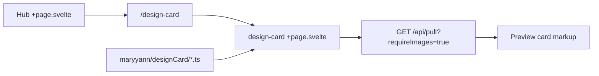

# Design Card experiment

## Plain English

You want a small playground experiment whose only job is to **preview a future shared card layout** so you can tune it before other experiments adopt it. Visitors open it from the hub like any other experiment (the hub row will read like your other uppercase experiment names — e.g. **DESIGN CARD** — with a short description).

The page will **pull random Wikipedia articles that already have a lead thumbnail** (same mechanism as `src/routes/gatcha-drop/+page.svelte`: `fetch('/api/pull?...&requireImages=true')`). Articles without images never appear in the response, so you do not need extra filtering beyond that flag.

Each preview **card** is a single article:

- **Shape:** Same proportions as a standard Pokémon card (trading card): about **63 mm × 88 mm**, i.e. portrait with `aspect-ratio: 63 / 88` in CSS so it scales on any screen.
- **Top ~70%:** The Wikipedia **thumbnail** URL from `WikiArticle.thumbnail`, shown as a **centered cover crop** (`object-fit: cover; object-position: center`) inside a fixed-height image band so wide or tall images behave consistently.
- **Bottom ~30%:** **Black text** on the card’s **#f4f3e1** background: the **article title** (`WikiArticle.title`) and a **single sentence** derived from the intro extract (`WikiArticle.extract`). The API already returns plaintext intro sentences (`sentences` query param, max 10). Practical approach: request **2 intro sentences** from the API, then **use only the first sentence** on the card (simple split on first `. ` after stripping, with a fallback to the whole extract if parsing is awkward). Optionally add **line clamping** (e.g. 2–3 lines max) so long sentences do not overflow on small widths.
- **Corners:** The **card surface** (the beige panel) uses **20px border radius** and `overflow: hidden` so the image respects the curve. Note: the workspace experiments rule prefers sharp corners elsewhere; this experiment is explicitly a **layout prototype**, so the rounded card is intentional **only on the preview card**, not on the whole app chrome.

**Supporting code location:** Put **pure helpers** (aspect ratio constant, “first sentence” helper, any copy trimming) under **`maryyann/designCard/`** so other experiments can later import the same layout math without copying. The **actual route** must live under SvelteKit’s tree: **`src/routes/design-card/`** (`+layout.svelte`, `+page.svelte`), following the same pattern as `maryyann/gatcha-drop/` + `src/routes/gatcha-drop/`.

**Hub:** Register a new experiment in `src/lib/experiments.ts` with slug `design-card` (URL `/design-card`, consistent with kebab-case slugs like `gatcha-drop`). Add strings under `en.experiments.designCard` in `src/lib/i18n/en.ts` (`name`, `description`, plus any UI strings: pull, loading, empty state, error).

**No new backends:** Continue using `src/routes/api/pull/+server.ts` only (no direct Wikimedia calls from the experiment).

---

## ASCII card (conceptual)

Portrait, Pokémon-like ratio; top is photo, bottom is text; corners rounded (shown schematically).

```text
                    ╭────────────────────────╮
                    │                        │
                    │                        │
                    │      IMAGE REGION      │
                    │    (~70% of height)    │
                    │   cover + centered     │
                    │                        │
                    │                        │
                    │                        │
                    ├────────────────────────┤
                    │  TITLE (bold, black)   │
                    │  One sentence from the│
                    │  article intro…        │
                    │ (~30% text block)      │
                    ╰────────────────────────╯
                 (63:88 width:height, 20px corner radius)
```

---

## Implementation sketch



1. **`maryyann/designCard/`** — e.g. `constants.ts` (background hex, aspect ratio), `sentence.ts` (first sentence from extract).
2. **`src/routes/design-card/+layout.svelte`** — Experiment header per rules (experiment name, no back link); page background can stay on DaisyUI `black` theme tokens.
3. **`src/routes/design-card/+page.svelte`** — Pull / refresh control, loading and empty states from i18n, one card preview using Tailwind (`aspect-[63/88]`, flex column with **~70% / ~30%** split e.g. `flex-[0.7]` / `flex-[0.3]` or `h-[70%]` / `h-[30%]`, `rounded-[20px]`, `bg-[#f4f3e1]`, `text-black`).
4. **Registration** — `src/lib/experiments.ts` + `src/lib/i18n/en.ts`.

---

## Open detail (minor)

- **“Fun fact” wording:** The API returns a neutral intro, not a curated “fun” line. The plan treats **first intro sentence** as the fact line unless you later add a dedicated source.

---

## Todos

- [ ] Add `maryyann/designCard/` (aspect/bg constants + first-sentence helper from `WikiArticle.extract`)
- [ ] Create `src/routes/design-card/+layout.svelte` and `+page.svelte` (pull with `requireImages`, card layout **70/30**, cover image, 20px radius)
- [ ] Add `en.experiments.designCard` strings and `experiments.ts` hub entry (slug `design-card`)
